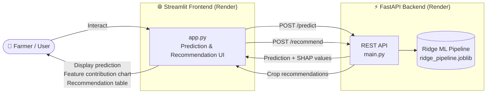

# 🌾 Agritech Answers

[](https://github.com/reemHasan/Agritech_Answers/actions/workflows/ci_api.yml)
[](https://github.com/reemHasan/Agritech_Answers/actions/workflows/cd_api.yml)
[](https://github.com/reemHasan/Agritech_Answers/actions/workflows/ci_ui.yml)
[](https://github.com/reemHasan/Agritech_Answers/actions/workflows/cd_ui.yml)


**A machine learning system that predicts crop yield and recommends the most profitable crop for a given parcel. Served through a FastAPI backend and a Streamlit interface, built from raw data to a deployed, CI/CD-automated application.**

---

## 1. Project Overview

### The problem

Farmers routinely make two decisions that directly determine their income: *"how much will this crop yield under my conditions?"* and *"which crop should I actually plant?"*. Both are traditionally answered from experience and intuition. This project turns them into a data-driven service with two functions:

- **Prediction** — given a crop and a parcel's growing conditions (rainfall, temperature, soil, fertilizer/irrigation use, ..), estimate the expected yield.
- **Recommendation** — given only the parcel's conditions, simulate every known crop and rank them by predicted yield, surfacing the most profitable choice.


### The two datasets

| Dataset | Nature | Granularity | Role |
|---|---|---|---|
| [**Agriculture CropYield Dataset**](https://www.kaggle.com/datasets/samuelotiattakorah/agriculture-crop-yield) | Synthetic (1,000,000 rows) | 1 row = 1 parcel | Primary training data for the production model |
| [**CropYield Prediction Dataset**](https://www.kaggle.com/datasets/patelris/crop-yield-prediction-dataset) | Real, FAO-style (~28,000 rows) | 1 row = country × crop × year | Explored as an enrichment source |

The synthetic dataset gave a large, clean sample to train on; the real dataset was used to sanity-check whether patterns found in the synthetic data (e.g. which variables matter, whether relationships are linear) actually hold in the real world — they didn't always, which is itself one of the project's more interesting findings (see [5](#5-machine-learning-workflow)).

---

## 2. Project Architecture



- **Frontend and backend are fully decoupled**, deployed as two independent Render services communicating over HTTP. The Streamlit app contains **no ML logic** — it only calls the API and renders the response.
- **`/predict`** returns a yield estimate *and* a closed-form linear feature-contribution breakdown (exact for the Ridge model — no `shap` dependency needed), rendered as a waterfall chart client-side.
- **`/recommend`** loops the same prediction over every known crop, server-side, and returns a ranked list.

---

## 3. Repository Structure

```
agritech_answers/
│
├── app/
│   ├── backend/                     # FastAPI service
│   │   ├── api/
│   │   │   ├── src/
│   │   │   │   ├── main.py              # Routes, lifespan/model loading
│   │   │   │   ├── pydantic_models.py   # Request/response schemas, Enums
│   │   │   │   ├── logger.py            # Structured JSON logging
│   │   │   │   └── helpers.py           # Model loading, prediction, SHAP-equivalent contributions
│   │   │   └── tests/
│   │   │       ├── test_main.py         # API routing/validation tests (fake model, no artifact needed)
│   │   │       └── test_helpers.py      # Validates the contribution math against a real fitted pipeline
│   │   ├── model/ridge_pipeline.joblib  # Trained pipeline artifact
│   │   ├── Dockerfile
│   │   ├── pyproject.toml               # Lean runtime deps only
│   │   └── uv.lock
│   │
│   └── frontend/                    # Streamlit UI
│       ├── app.py
│       ├── assets/                      # Logo, banner
│       ├── Dockerfile
│       ├── requirements.txt
│       └── .streamlit/
│
├── ml/
│   ├── notebook/                    # EDA, PCA/FAMD exploration
│   └── src/                         # Training pipeline scripts
│       ├── track1_compare_models.py     # Ridge/LinearRegression/LightGBM/CatBoost/RF, 5-fold CV
│       ├── tune_ridge.py                 # Randomized search on Ridge's alpha/solver
│       ├── train_final_model.py          # Refits on full train, evals val/test, registers in MLflow
│       ├── track1_ablation.py            # Ridge + CatBoost ablation, dataset1 primary
│       ├── track2_ablation.py            # Ridge + CatBoost ablation, dataset2 primary (reversed merge)
│       ├── track2_compare_models.py   # 5-model comparison on the reversed merge
│       └── utils_app.py       # Generates UI bounds from real data, load tuned & fitted mlflow model into joblib
│
├── data/                            # Raw/intermediate datasets (gitignored)
├── .github/workflows/               # ci_api, cd_api, ci_ui, cd_ui
├── render.yaml                      # Render Blueprint: both services, API_URL auto-linked
├── pyproject.toml                   # Root: full research/dev environment
└── README.md                        # You are here
```

---

## 4. Tech Stack

| Layer | Technologies |
|---|---|
| **Modeling** | scikit-learn (Ridge, Random Forest), LightGBM, CatBoost, `prince` (FAMD) |
| **Experiment tracking** | MLflow (runs, metrics, model registry) |
| **Data** | pandas, numpy |
| **Backend API** | FastAPI, Pydantic, Uvicorn |
| **Frontend** | Streamlit, matplotlib (waterfall chart) |
| **Testing** | pytest |
| **Packaging** | uv (backend), pip (frontend) |
| **Containerization** | Docker (multi-stage builds) |
| **CI/CD** | GitHub Actions |
| **Hosting** | Render (both services) |

---

## 5. Machine Learning Workflow


1. **EDA & cleaning** — explored both datasets independently; found dataset1 to be synthetic (uniform crop distribution, no real geographic anchor) and dataset2 to contain 4,411 exact duplicates (removed).
2. **Merge strategy** — the **crop identity** was the only viable join key, requiring name harmonization (`"Rice"` ↔ `"Rice, paddy"`, etc.).
3. **Key variable identification (PCA / FAMD)** — PCA on dataset1 showed all numeric variables carrying ~equal, independent variance (a synthetic-data signature); PCA on dataset2 showed the correlated structure expected of real climate data, validating that dataset1's independence was a property of its generation process, not agriculture in general.
4. **Enrichment ablation** — rigorously tested (Ridge *and* CatBoost, 5-fold CV, paired t-tests) whether enriching one dataset with the other's aggregated features helps prediction. Result: **no benefit** enriching dataset1 with dataset2 (p > 0.05 both models); a small but statistically significant benefit (p = 0.045) enriching dataset2 with dataset1 — but *only* under CatBoost, since the enrichment features are collinear with information Ridge already has via crop identity.
5. **Model comparison** — on a sample of 200k from dataset1, we tried 5 candidates (Ridge, Linear Regression, LightGBM, CatBoost, Random Forest) via 5-fold CV. Ridge and Linear Regression tied for best accuracy with near-zero overfit, while tree ensembles showed progressively larger overfit gaps — evidence the true relationship in this dataset is close to linear.
6. **Hyperparameter tuning** — randomized search on Ridge's `alpha`/`solver`, over 100k rows as sample from dataset1, confirmed regularization strength has no meaningful effect (no problematic collinearity to correct), so `alpha=1.0` was retained for numerical robustness.
7. **Final model** — **Ridge (alpha=1.0)**, trained on dataset1's native features only (no cross-dataset enrichment), refit on the full training set (700k row), and evaluated once on held-out validation (150k row) and test (150k row) sets. Feature importance: rainfall, fertilizer use, and irrigation jointly explain ~95% of yield variance.

---

## 6. MLOps Workflow

- **Experiment tracking**: every training run (baseline comparisons, ablations, hyperparameter search) is logged to **MLflow** — parameters, per-fold metrics, feature importance/coefficient tables and charts, and model artifacts.
- **Model registry → deployable artifact**: the final Ridge pipeline is registered in MLflow, then exported as a plain `joblib` file for the API — lighter runtime, no MLflow dependency needed just to serve predictions.
- **Explainability in production**: `/predict` computes exact, closed-form linear feature contributions at request time (no `shap` library needed — see [`helpers.py`](app/backend/api/src/helpers.py)), rendered as a waterfall chart in the UI.
- **Containerization**: both services are multi-stage Docker builds (backend uses `uv` for fast, reproducible dependency installs).
- **CI/CD**: fully automated test → build → deploy pipeline for both services — see [11](#11-cicd-pipeline).
- **Deployment**: both services on Render, defined as code in a single [`render.yaml`](render.yaml) Blueprint — see [12](#12-deployment-render).

---

## 7. Installation

**Prerequisites**: Python 3.12, [`uv`](https://docs.astral.sh/uv/), Docker (optional, for containerized runs).

```bash
git clone <https://github.com/reemHasan/Agritech_Answers.git>
cd agritech_answers
```

**Backend:**
```bash
cd app/backend
uv sync
```

**Frontend:**
```bash
cd app/frontend
pip install -r requirements.txt
```

---

## 8. Running Locally

**Backend** (from `app/backend/api/src`, with `app/backend`'s venv active):
```bash
cd app/backend
uv run --project . uvicorn main:app --app-dir api/src --reload
```
API docs available at `http://localhost:8000/docs` (FastAPI's auto-generated Swagger UI).

**Frontend** (second terminal):
```bash
cd app/frontend
streamlit run app.py
```
Set `API_URL` (env var, or `secrets.toml`) to point at the backend — defaults to `http://localhost:8000`.

**Or with Docker**, from repo root:
```bash
docker build -f app/backend/Dockerfile -t crop-yield-api ./app/backend
docker run -p 8000:8000 crop-yield-api

docker build -f app/frontend/Dockerfile -t crop-yield-ui ./app/frontend
docker run -p 8501:8501 -e API_URL=http://host.docker.internal:8000 crop-yield-ui
```

---

## 9. API Endpoints

| Endpoint | Method | Purpose |
|---|---|---|
| `/` | GET | Health check — `200` with `model_loaded: true` if ready, `503` otherwise |
| `/predict` | POST | Yield prediction for one chosen crop + parcel context |
| `/recommend` | POST | Ranks all known crops by predicted yield for a given parcel context |

**`POST /predict`** — request:
```json
{
  "Region": "West", "Soil_Type": "Loam", "Rainfall_mm": 850.0,
  "Temperature_Celsius": 24.5, "Fertilizer_Used": true, "Irrigation_Used": true,
  "Weather_Condition": "Sunny", "Days_to_Harvest": 120, "Crop": "Wheat"
}
```
response:
```json
{
  "crop": "Wheat",
  "predicted_yield_tons_per_hectare": 5.24,
  "base_value": 4.98,
  "contributions": [
    {"feature": "Rainfall_mm", "contribution": 0.61},
    {"feature": "Fertilizer_Used", "contribution": 0.32},
    {"feature": "Irrigation_Used", "contribution": -0.09}
  ]
}
```

**`POST /recommend`** — same request body, minus `Crop`; response is a `recommendations` list of `{crop, predicted_yield_tons_per_hectare, rank}`, sorted descending.

---

## 10. Testing

```bash
cd app/backend
uv sync
uv run pytest -v
```

- **`test_main.py`** — API routing, request validation (Enums, numeric bounds), the 503-when-model-not-loaded path, and `/recommend`'s ranking logic — all against a lightweight fake model, so tests run fast with no trained artifact required.
- **`test_helpers.py`** — validates the feature-contribution math itself against a small, real, fitted pipeline: confirms `base_value + Σcontributions == model prediction` exactly, and that one-hot dummies correctly collapse back to their parent feature.
---

## 11. CI/CD Pipeline

This project uses four GitHub Actions workflows — a symmetric CI/CD pair
for the backend API and another for the Streamlit frontend. All workflow
files live in `.github/workflows/`.

| | Backend | Frontend |
|---|---|---|
| **CI** | `ci_api.yml` — pytest + Docker build validation | `ci_ui.yml` — Docker build validation |
| **CD** | `cd_api.yml` — deploy to Render, gated on CI passing | `cd_ui.yml` — deploy to Render, gated on CI passing |

### Overview
 
```
  push/PR to app/backend/**                push/PR to app/frontend/**
            │                                          │
            ▼                                          ▼
   ┌─────────────────┐                       ┌───────────────────┐
   │   ci_api.yml    │                       │    ci_ui.yml      │
   │  test → build   │                       │      build        │
   └────────┬────────┘                       └────────┬──────────┘
            │ on success                              │ on success
            ▼                                         ▼
   ┌─────────────────┐                       ┌───────────────────┐
   │   cd_api.yml    │                       │    cd_ui.yml      │
   │ deploy (Render) │                       │  deploy (Render)  │
   └─────────────────┘                       └───────────────────┘
```
 
Each CD workflow only runs after its matching CI workflow succeeds on
`main` (via `workflow_run`) — a failing test or a broken Dockerfile blocks
deployment entirely, rather than Render deploying regardless of outcome.
 
### Workflows
 
#### 1. `ci_api.yml` — CI: API tests + Docker build validation
 
**Triggers:** `push`/`pull_request` on `main`, only when `app/backend/**` changes; `workflow_dispatch`.
 
| Job | What it does |
|---|---|
| `test` | Installs dependencies with `uv`, runs the full `pytest` suite (`app/backend/api/test_main.py` + `test_helpers.py`) against a fake model and a small real fitted pipeline — no trained model artifact needed, so this runs fast and deterministically on every PR. |
| `build` | Builds the API's Docker image (`docker/build-push-action`, `push: false`) to confirm the Dockerfile itself is valid. Validation only, nothing is pushed — catches Dockerfile regressions (a broken `COPY` path, a missing `WORKDIR`) immediately, rather than only discovering them when Render attempts the same build during an actual deploy. |
 
#### 2. `cd_api.yml` — CD: deploy the API to Render
 
**Triggers:** automatically via `workflow_run`, once `CI — API` completes successfully on `main`; `workflow_dispatch` for a manual redeploy without a new commit.
 
| Job | What it does |
|---|---|
| `deploy` | POSTs to Render's Deploy Hook for the `crop-yield-api` service, which tells Render to pull the latest commit and rebuild/redeploy the container server-side, directly from the Dockerfile. |
 
No image registry push (e.g. Docker Hub) is used: Render builds its own copy of the image itself, and nothing else in this project's architecture consumes a separately-hosted image, so a registry push would be an artifact with no actual consumer — added complexity without a corresponding benefit here.
 
#### 3. `ci_ui.yml` — CI: frontend Docker build validation
 
**Triggers:** `push`/`pull_request` on `main`, only when `app/frontend/**` changes; `workflow_dispatch`.
 
| Job | What it does |
|---|---|
| `build` | Builds the frontend's Docker image (validation only, no push) — same reasoning as the API's build job. No dedicated unit test suite runs here: the frontend contains no business/ML logic of its own (it's a thin client over the already-tested API), so a test suite was judged not worth the added maintenance. Docker build validation is still worth doing regardless, since it's an infrastructure check, not a business-logic check. |
 
#### 4. `cd_ui.yml` — CD: deploy the frontend to Render
 
**Triggers:** automatically via `workflow_run`, once `CI — UI` completes successfully on `main`; `workflow_dispatch`.
 
| Job | What it does |
|---|---|
| `deploy` | POSTs to Render's Deploy Hook for the `crop-yield-ui` service. |
 
### On failure notifications
 
No dedicated Slack (or similar) integration is used. GitHub Actions already
emails the user who triggered a run on workflow failure by default, with zero setup required, and Render
separately emails on failed deploys.
 
 
### How to read pipeline status
 
The badges at the top of the `README.md` reflect each workflow's most
recent run on `main` — green means the last run passed, red means it
failed. Click a badge to jump straight to that workflow's run history in
the Actions tab.
 
### Local equivalents
 
To reproduce what CI does, locally:
 
```bash
# What ci_api.yml's `test` job does:
cd app/backend
uv sync
uv run pytest api/ -v
 
# What ci_api.yml's `build` job does:
docker build -f app/backend/Dockerfile -t crop-yield-api:local ./app/backend
 
# What ci_ui.yml's `build` job does:
docker build -f app/frontend/Dockerfile -t crop-yield-ui:local ./app/frontend
```
---

## 12. Deployment (Render)

Both services are defined in one root-level [`render.yaml`](render.yaml) Blueprint:

| Service | Source | Context | Deploy trigger |Auto-linked |
|---|---|---|---|---|
| `crop-yield-api` | `app/backend/Dockerfile` | `app/backend` | `cd_api.yml`, after `ci_api.yml` tests pass |— |
| `crop-yield-ui` | `app/frontend/Dockerfile` | `app/frontend` | `cd_ui.yml`, on push to `app/frontend/**` | `API_URL` resolves automatically from `crop-yield-api`'s deployed hostname via `fromService` |

Both services have Render's own "Auto-Deploy" setting turned **off**
(`autoDeploy: false`) — deploys only happen via the CI/CD workflows' deploy
hooks, never on a raw, untested push.


### Required secrets & repository variables
 
Configure under **Repo Settings → Secrets and variables → Actions**:
 
| Name | Type | Used by | Purpose |
|---|---|---|---|
| `RENDER_API_DEPLOY_HOOK_URL` | Secret | `cd_api.yml` | Triggers the API's Render deploy |
| `RENDER_UI_DEPLOY_HOOK_URL` | Secret | `cd_ui.yml` | Triggers the UI's Render deploy |
 
(Render Dashboard → each service → Settings → Deploy Hook)